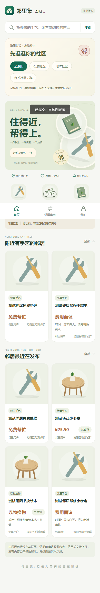
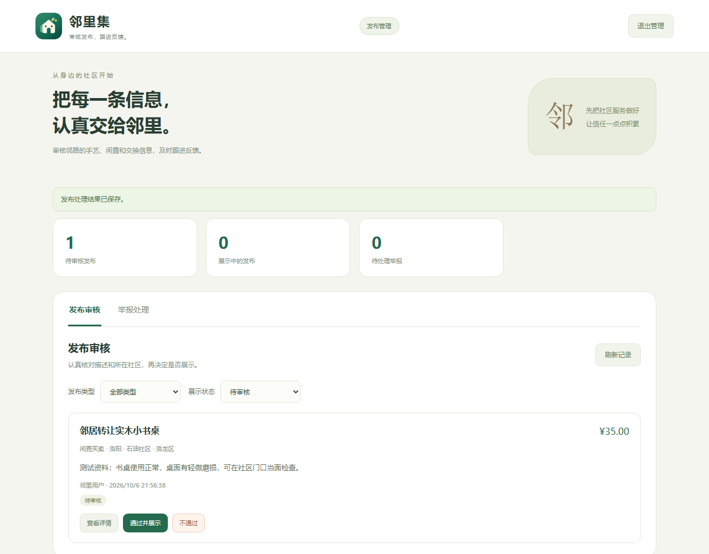

# 邻里集

居民自己发布的社区便民应用：转让闲置、分享手艺、交换物品。无需先招募商家，也不依赖微信群接口。

Vue 3 / uni-app · Node.js 24 · SQLite · Android · 微信小程序

## 先跑起来

安装 Node.js 24.18+（24.x），在项目目录执行：

```sh
npm ci
npm run quickstart
```

打开 **http://127.0.0.1:8788** 注册居民账号。管理页面是 **http://127.0.0.1:8788/admin/**，账号 `admin`，首次生成的随机密码保存在 `.local/runtime.env`。

发布后先进入审核。用管理账号核对并通过，居民页面才会展示。不需要微信密钥，也不需要先买服务器。详细流程见 [本机启动](docs/quickstart.md)。

## 可以做什么

- 发布闲置买卖、邻里手艺、以物换物；手艺可标注固定费用、面议或免费。
- 上传最多四张照片；修改后重新审核，照片跟随发布状态控制展示。
- 按城市、社区、分类和关键词查找信息，分页浏览。
- 浏览无需登录，登录后查看联系电话；支持举报、下架与账号注销。
- 管理员独立登录，审核发布、查看照片并处理举报。
- 下载安卓包，连接自己部署的 HTTPS 服务；也可以直接使用网页。

洛阳、石油社区和地矿社区是初始示例，城市和社区都可以更换。社区名称只用于筛选，不代表微信群成员权限。

## 页面

下面是隔离测试环境的截图，内容为自动化测试资料。





## 下载与部署

安卓安装包见本仓库 **Releases**。安装后填写运营者的 HTTPS 服务地址；项目没有预置一个供所有下载者共用的公共服务器。

| 目标                     | 入口                             |
| ------------------------ | -------------------------------- |
| 本机完整流程             | [快速启动](docs/quickstart.md)   |
| 服务器部署、备份和恢复   | [部署说明](docs/deployment.md)   |
| 安卓 APK、签名、微信构建 | [客户端构建](docs/android.md)    |
| 测试与复现               | [测试说明](docs/testing.md)      |
| 模块、数据流和限制       | [架构说明](docs/architecture.md) |
| 实现顺序与具体取舍       | [开发记录](docs/development.md)  |
| 接口字段和发布示例       | [API](docs/api.md)               |

```sh
npm test
npm run build               # dist/web
npm run build:android-web   # dist/android-web
# 配置 Android SDK 与签名后：
python scripts/build-android-release.py
```

微信小程序使用自己的 AppID 和服务地址构建，平台备案与审核由部署者办理。密钥、数据库、居民照片和签名均不属于公开源码。

## 项目范围

目前完成信息发布、审核、联系和反馈这条流程。没有线上付款、物流、即时聊天、交易担保或微信账号合并。后端按单实例 SQLite 设计，未做大规模并发测试；适合从具体社区开始验证使用情况。

代码中保留早期商品目录和预约的演示模块，正式模式不开放这些交易操作。开发、构建和验证的真实边界见文档，不以截图或打包成功代替公网运营和真机验收。

## 参与与许可

欢迎提交明确的复现步骤或小范围改进，提交前阅读 [贡献说明](CONTRIBUTING.md)。涉及凭证或越权的问题见 [安全说明](SECURITY.md)。

[MIT License](LICENSE)。图标与分类插画源文件位于 `design/`，依赖遵循各自许可证。
