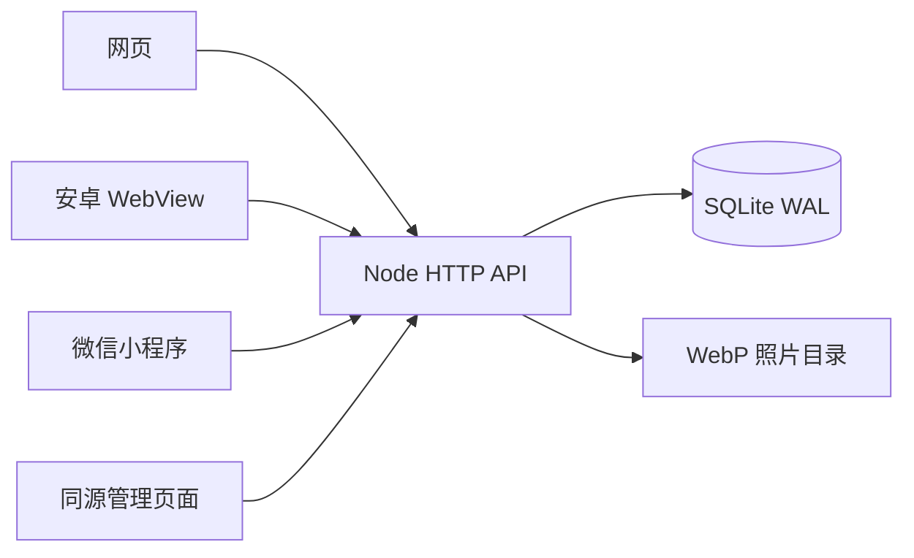
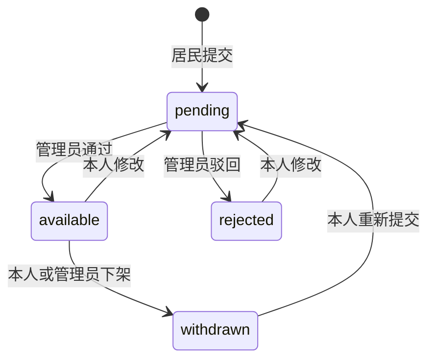

# 结构与边界

客户端使用 Vue 3 和 uni-app，共用居民页面。Android 使用一个小型原生 WebView 容器加载随包资源，通过 HTTPS 访问运营者的服务。微信构建使用相同页面和独立登录凭证，受微信发布与分享规则约束。

服务端使用 Node.js 24 原生 HTTP 与 `node:sqlite`。身份、发布、审核、举报和照片元数据保存在 SQLite；图片压缩后单独保存。没有额外的 Redis、消息队列或云存储依赖。

## 发布状态

修改标题、描述、图片或联系方式都重新审核。审核操作带预期状态，避免两个管理员页面互相覆盖结果。历史演示模式另有预约状态 `reserved`，正式服务不开放在线预约和支付。

## 访问控制

- 匿名只能读取公开发布与公开照片，返回值不含手机号。
- 居民使用 Bearer 会话，服务端只保存随机 token 的摘要；账号密码使用独立随机盐和 scrypt。
- 本人可读待审内容；待审照片使用十分钟签名链接。短期链接具有访问权限，不应转发。
- 上传每次一张、最多 5 MB，解码上限 2000 万像素，最长边 1600 像素；转换 WebP 并移除元数据。每条发布最多四张，照片必须属于发布者。
- 管理员使用独立的八小时内存会话；公网 Cookie 含 Secure、HttpOnly、SameSite=Strict。写操作校验 Origin 与 JSON，普通居民 token 不能访问管理接口。
- 下架后未签名的照片地址立即不可读；清除物理文件有定期任务。已被外部保存的图片无法通过本系统召回。

## 模块位置

| 目录或文件                           | 职责                                   |
| ------------------------------------ | -------------------------------------- |
| `apps/client/src/pages`              | 首页、集市、发布、详情、账号与城市选择 |
| `apps/client/src/lib/api.js`         | 连接地址、会话隔离、请求与上传         |
| `apps/operations`                    | 管理员登录、审核与举报页面             |
| `apps/android-release`               | Android 容器、系统选图、拨号入口       |
| `server/index.mjs`                   | 路由、权限检查与事务操作               |
| `server/auth.mjs` / `admin.mjs`      | 居民和管理员身份                       |
| `server/media.mjs`                   | 上传验证、压缩、授权读取与清理         |
| `server/listings.mjs`                | 发布类型、字段规则、筛选与分页         |
| `scripts/backup.mjs` / `restore.mjs` | 数据与照片的快照、校验和恢复           |

## 已知限制

目前是单进程、单机数据库实现，未做大规模并发压测。列表在内存中过滤后分页，适合初始社区规模；内容量增长后需要把筛选和分页下推到带索引的数据库查询。不要用多个实例共享同一 SQLite 网络磁盘。

没有即时聊天、线上支付、物流、交易担保、地理距离计算、短信找回或群成员认证。社区名称由居民填写，运营者需要处理同名和别名问题。客户端账号与微信账号不自动合并。现有接口可继续扩展，但这些能力不计入本版交付。
